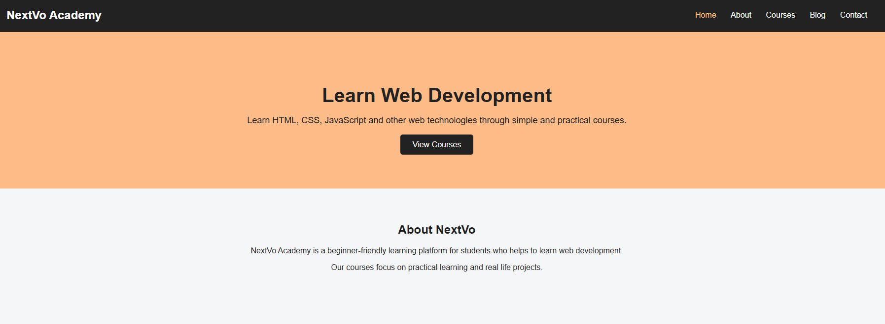
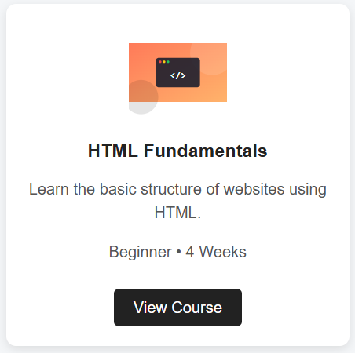
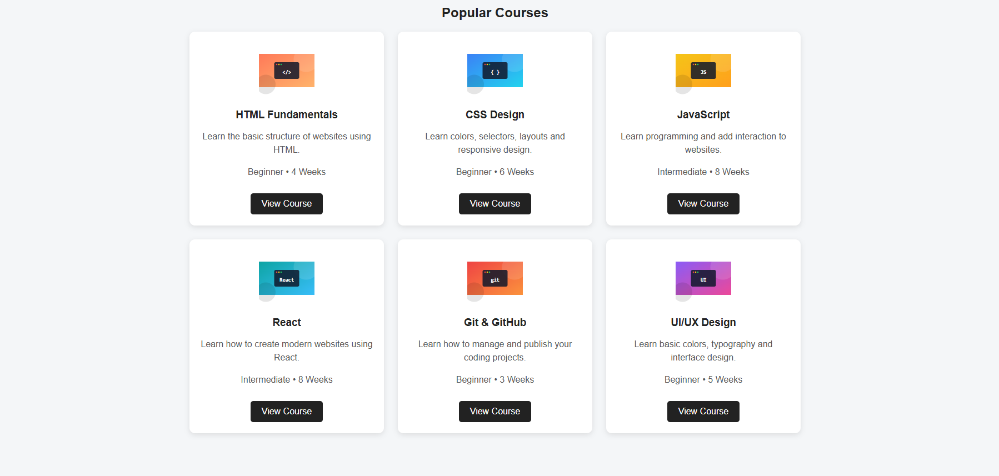
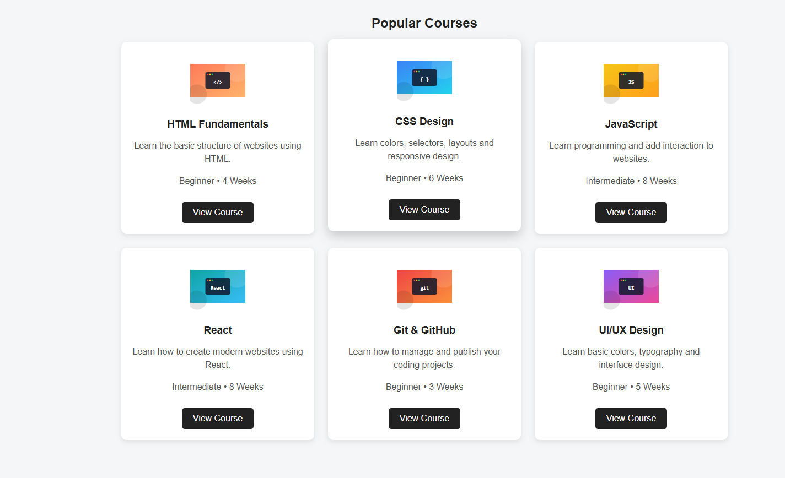

# HTML & CSS — Navigation Bar and Card Design

## Student Information

| | |
|---|---|
| **Name** | Shrawan Bishwakarma |
| **Student ID** | [ 2602412408] |
| **Course / Module** | BSc (Hons) Software Engineering |
| **Level** | Level 4 / 1st Semester |
| **Assignment** | HTML & CSS Practical — Navigation Bar and Responsive Card Layout |

## Project Description

CodeNest Academy is a simple website created for an HTML and CSS practical assignment.

The website is designed for a fictional web development academy. It contains a navigation bar, home section, about section, six course cards, blog section, contact section, and footer.

The website uses CSS Grid to arrange the course cards. On larger screens, three cards are displayed in each row. On tablets, two cards are displayed in each row, and on mobile devices, one card is displayed in each row.

The website also includes hover effects for navigation links, buttons, and course cards.

## Technologies Used

- HTML5
- CSS3
- CSS Flexbox
- CSS Grid
- CSS Media Queries
- Responsive Web Design

## Learning Resources

| No. | Resource | Topic Learned | What I Learned | How I Applied It |
|---|---|---|---|---|
| 1 | Teacher's lecture/material | HTML Structure | I learned how HTML elements are used to structure a webpage. | I used `<header>`, `<nav>`, `<section>` and `<footer>` in my webpage. |
| 2 | University material | CSS Selectors | I learned how class, element and ID selectors can be used to style HTML elements. | I used selectors such as `.card`, `.section`, `nav a` and `#courses`. |
| 3 | YouTube tutorial | Flexbox | I learned how Flexbox can arrange elements horizontally and vertically. | I used `display: flex` in the navigation bar. |
| 4 | MDN Web Docs | CSS Grid and Responsive Design | I learned how CSS Grid creates rows and columns and how media queries make websites responsive. | I used CSS Grid for the course cards and media queries for tablet and mobile layouts. |

## Screenshots

### Navigation Bar



### Card Design



### Card Layout



### Hover Effect



## Key Concepts Learned

### 1. Semantic HTML

I learned that semantic HTML elements describe the purpose of different parts of a webpage.

I used elements such as:

```html
<header>
<nav>
<section>
<footer>
